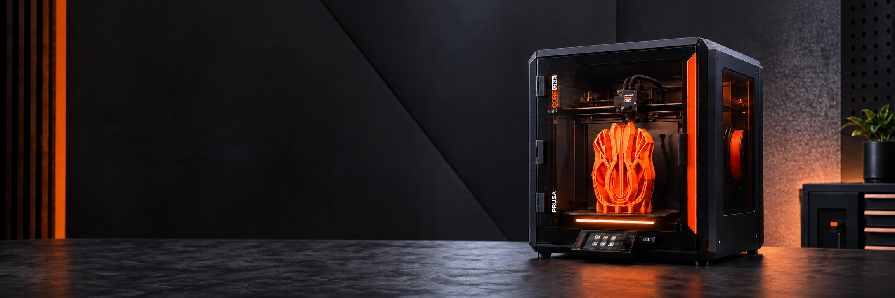

# Zeeq CORE ONE Lightbar+ installation guide

This guide covers fitting a pre-assembled Zeeq CORE ONE Lightbar+ to a Prusa CORE ONE / CORE ONE+ and connecting it to the printer through PrusaLink. You do **not** need to flash firmware during normal installation. Keep the printer switched off while fitting or routing the lightbar.

*Illustration only. Use the supplied mounting parts and confirm clearance on your particular printer.*

## Before you start

- Check that the lightbar, controller, supplied mounting parts, cable clips, and the power lead supplied with your kit are present and undamaged.
- Have access to a **2.4 GHz Wi-Fi network** that can reach your printer on the local network. If the printer and lightbar are on separate VLANs, routing and firewall rules must allow the connection.
- Enable **PrusaLink** on the printer and find its IP address and API key in the printer's **Settings → Network → PrusaLink** menu. The menu wording may vary with printer firmware.
- Use only the supplied power arrangement. Do not connect the lightbar to an unidentified printer power rail or feed 5 V into an ESP32 GPIO.

## 1. Fit the lightbar

1. Turn the printer off and let the bed and toolhead cool.
2. Fit the lightbar **below the print bed** using the supplied mounting parts. Orient the diffuser toward the intended illuminated area.
3. Move the bed and toolhead through their full travel by the method recommended for your printer, and check that neither can touch the bar, mounts, or cable. Also check door clearance.
4. Do not continue until the mounting is secure and the full motion path is clear.

## 2. Route the cable and connect power

1. Route the cable along the frame with the supplied clips, away from the bed, belts, toolhead, and other moving or hot parts.
2. Leave a gentle bend at each connection and provide strain relief; do not pinch the cable under a panel.
3. Connect the controller and the **supplied power lead**. Make sure the connectors are fully seated before turning the printer on.
4. Switch the printer on. A new or unconfigured lightbar should advertise the setup Wi-Fi network and show its yellow setup animation after the startup delay.

## 3. Join the lightbar's setup network

Join the open Wi-Fi network **`CORE-One-Lightbar`**. You can scan this code or select the network manually:

The captive portal should open automatically. If it does not, stay connected to the lightbar network and open **http://192.168.4.1** in a browser. Some phones warn that this temporary setup network has no internet connection; choose to remain connected.

## 4. Connect Wi-Fi and PrusaLink

1. On the setup page, select your **2.4 GHz** Wi-Fi network (or enter a hidden SSID) and enter its password.
2. Press **Save**. The lightbar tests the credentials and reports whether it connected. If the test fails, correct the SSID/password and try again.
3. After the lightbar joins your network, open **http://core-one-lightbar.local** or the address shown by your router. If you renamed the device, use its configured `.local` name instead.
4. On **Network**, enter the printer IP address or hostname and its **PrusaLink API key**. **Auto-detect** can help find the printer; **Test** checks the entered details. Press **Save** to keep them.
5. On **Light strip**, verify that the detected strip type and LED count match your supplied assembly. Only change the strip type if your specific hardware requires it. Set brightness to your preference, then press **Save**.

## Final check

- [ ] Bar, mounts, and cable remain clear throughout the printer's motion range.
- [ ] No connector, wire, or controller becomes hot or loose.
- [ ] The lightbar joins Wi-Fi and its **Network** page reports a connection.
- [ ] **PrusaLink Test** returns the printer state.
- [ ] Starting a print changes the lightbar to its configured print/progress display.

## If something does not work

| Symptom | What to check |
| --- | --- |
| No light | Supplied power lead and controller/strip connections; allow for the startup dark delay. |
| Setup page does not open | Stay connected to `CORE-One-Lightbar` and browse to `http://192.168.4.1`. |
| Wi-Fi test fails | Confirm 2.4 GHz SSID/password and signal strength; retry after checking the router. |
| PrusaLink test fails | Check the printer address and API key, then confirm the printer and lightbar can reach each other on the LAN. |
| Previously configured Wi-Fi is unavailable | The setup network returns when the lightbar cannot connect; reconnect to it and update the network settings. |

To clear saved settings, hold the casing's **Plus button** for ten seconds, then release it to restart into setup mode. This erases saved Wi-Fi, printer credentials, colors, schedules, and update preferences; it does not roll back firmware.

For help, [open a support issue](https://github.com/kelau/prusa-core-one-plus-lightbar-releases/issues) and include the firmware version, printer model, a description of the problem, and a clear photo or video where useful. Do not post Wi-Fi passwords or PrusaLink API keys.

Zeeq CORE ONE Lightbar+ is an independent product and is not affiliated with or endorsed by Prusa Research.
